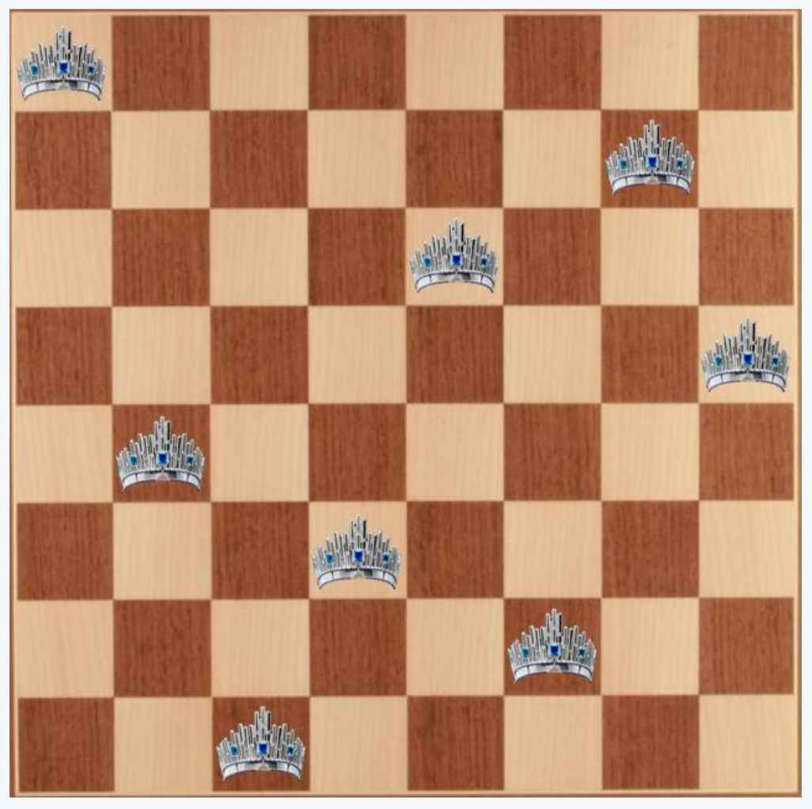

# N-Queen-RL

Solving the classical N Queen problem using Reinforcement Learning.

- **Name**: Viviana Márquez
- **Finalized Research Question**: Can I make a RL agent learn how to find solutions to the n-queen problem?
- **List of ideas to finish project in GitHub**: 
    - Make the agent learn the best policy given the following strategies: 
        - Random placement
        - Sequential placement
        - Knight placement
        - Hybrid placement
- **Working Code in GitHub**: [Here](https://nbviewer.jupyter.org/github/vivianamarquez/N-Queen-RL/blob/master/Queens%202019.ipynb)
